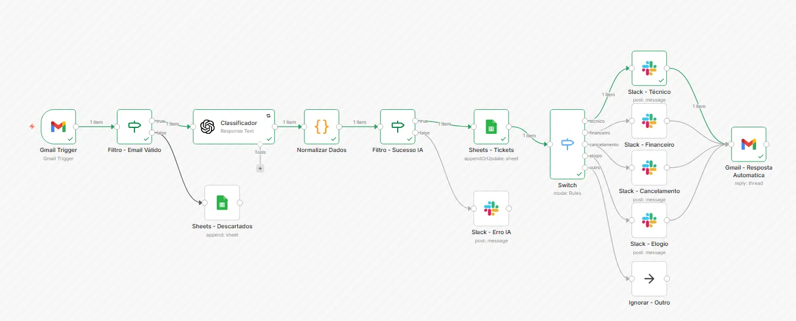

# Nexus Telecom — Triagem Automática de E-mails com IA

> Projeto fictício baseado em um caso de uso real, desenvolvido para fins de estudo e portfólio.

---

Toda empresa que tem suporte ao cliente enfrenta o mesmo problema: alguém precisa ficar horas por dia lendo e-mail por e-mail, decidindo para qual setor encaminhar cada um. É um trabalho repetitivo, cansativo e que tira uma pessoa de atividades muito mais importantes.

Foi pensando nisso que criei esse projeto. Uma triagem manual de 50 e-mails por dia pode levar de 1 a 2 horas. Esse workflow faz isso em segundos, sem intervenção humana — o e-mail chega, a IA lê, classifica, gera o ticket e notifica o time certo automaticamente.

---

---

## Como funciona na prática

Quando um cliente manda um e-mail, o workflow entra em ação:

1. Verifica se o e-mail é válido — filtra mensagens automáticas e e-mails vazios antes mesmo de acionar a IA
2. Manda o conteúdo para o GPT-4o-mini, que lê e classifica: é problema técnico? financeiro? cancelamento? elogio?
3. Gera um ticket com ID único e define o prazo de resposta baseado na urgência
4. Registra tudo no Google Sheets para controle
5. Notifica o canal correto no Slack para o time agir
6. Responde automaticamente ao cliente no Gmail

---

## O que o workflow classifica

| Categoria | Exemplos |
|---|---|
| Técnico | Internet lenta, sem conexão, queda de sinal |
| Financeiro | Boleto, fatura, cobrança errada, segunda via |
| Cancelamento | Cliente quer encerrar o contrato |
| Elogio | Agradecimento, satisfação com o serviço |
| Outro | Qualquer coisa fora das categorias acima |

---

## Como o workflow lida com falhas

Para garantir que nenhum e-mail se perca, mesmo que algo dê errado, o workflow tem 5 camadas de proteção:

**Filtro pré-IA** — e-mails inválidos são bloqueados antes de qualquer processamento e registrados numa aba separada para auditoria. Isso também evita gastar tokens da OpenAI à toa.

**Retry automático no OpenAI** — se a API falhar ou travar, o workflow tenta mais 2 vezes com intervalo de 2 segundos antes de desistir. Um problema pontual não derruba o processo inteiro.

**Try-catch no Code JS** — se a IA retornar algo fora do formato esperado, o fluxo não quebra. Ele marca o ticket como falha e segue em frente, sem perder o e-mail.

**Rota de erro** — tickets que falharam na classificação são desviados para um canal de erros no Slack com todos os dados do remetente, para ação manual.

**Error Trigger global** — um workflow separado que fica escutando qualquer falha em qualquer nó. Se o Sheets cair, o Slack sair do ar ou qualquer coisa inesperada acontecer, um alerta é enviado automaticamente.

---

## Stack

- **n8n** — orquestração do workflow
- **OpenAI GPT-4o-mini** — classificação dos e-mails
- **Google Sheets** — log de tickets e descartados
- **Slack** — notificações por categoria e alertas de erro
- **Gmail** — entrada dos e-mails e resposta automática
- **Oracle Cloud Free Tier** — servidor onde o n8n roda (Ubuntu 22.04, Docker)

---

## Como importar no seu n8n

1. Baixe o arquivo `Nexus Telecom.json`
2. No n8n, clique em **+** → **Import from file**
3. Configure as credenciais: Gmail, OpenAI, Google Sheets e Slack
4. Ajuste o ID da planilha Google Sheets no nó `Sheets - Tickets`
5. Crie um workflow separado com o nó `Error Trigger` e vincule em Settings → Error Workflow
6. Ative o workflow

> Em produção real, recomendo usar um e-mail dedicado de suporte em vez de e-mail pessoal, para evitar que notificações automáticas sejam processadas pelo workflow.
